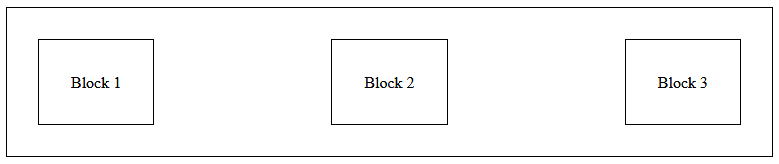
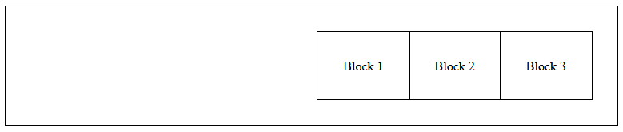
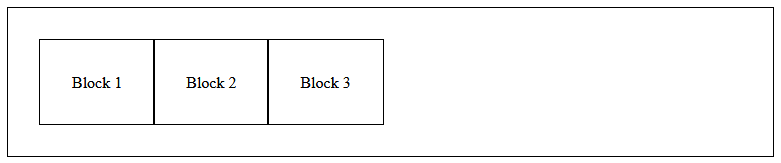
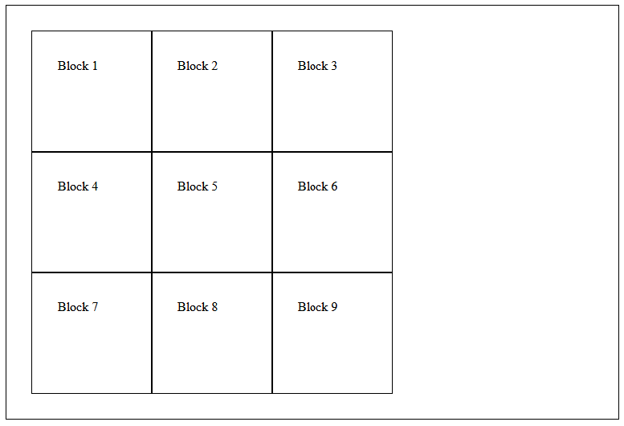
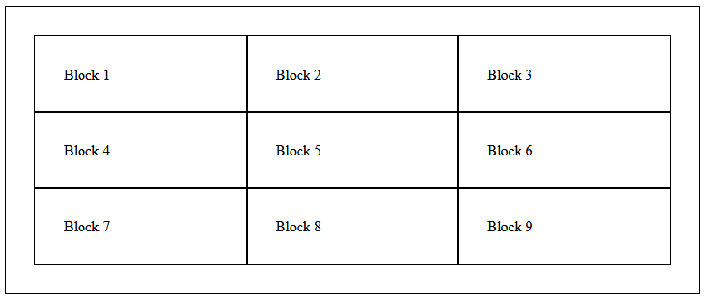
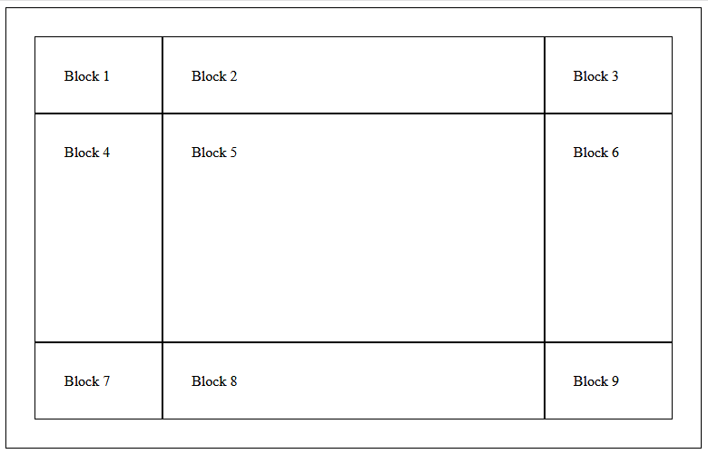
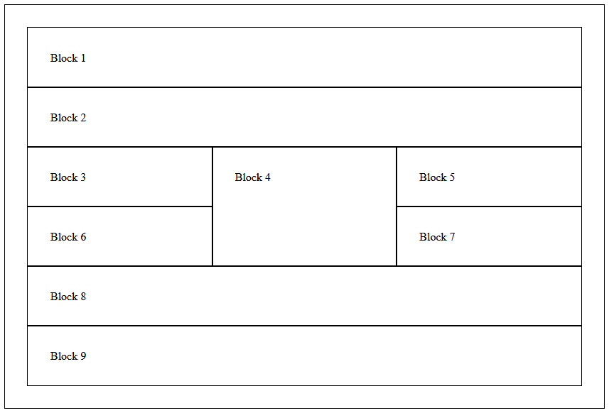

# CHT2531 Page Layout with CSS
1. Download the file [list-based-navigation.html](list-based-navigation.html).
    * Add some CSS to this page. Check it works.
    * Try and make the list into a horizontal navigation bar.
    * Here are some CSS properties that will help:
        * display
        * text-decoration
        * padding/width

2. Download the file [flexbox.html](flexbox.html).
    * Add some CSS to this page. Check it works.
    * Put an outline and some padding around each of the *div* elements e.g.
    * 
    ```css
    div{
        outline:1px solid red;
        padding:2.0em;
    }
    ```
    * Using the flex properties create the following arrangements




3. Download the file [grids.html](grids.html).
    * Add some CSS to this page. Check it works.
    * Put an outline around each of the <div> elements.
    * Using the grid properties create the following arrangements. For the second, third and fourth examples the grid should resize to the browser width.

(a)
    
(b)
    
(c)
    
(d)
    


4. Change the *div* tags in the CSS Grid example to use suitable semantic elements e.g. *header*, *footer* etc. Add CSS to create the 'holy grail' of web design i.e. a full width header and footer, and three columns.


5. Combine some of the above:
    * Use a flexbox to arrange the navigation options in exercise 1
    * Place this navigation bar in the header of exercise 4.

## Resources to help

### Flexbox
* https://developer.mozilla.org/en-US/docs/Web/CSS/CSS_Flexible_Box_Layout/Basic_Concepts_of_Flexbox
* https://css-tricks.com/snippets/css/a-guide-to-flexbox/
* https://developer.mozilla.org/en-US/docs/Learn/CSS/CSS_layout/Flexbox

### CSS Grids
* https://css-tricks.com/snippets/css/complete-guide-grid/
* https://developer.mozilla.org/en-US/docs/Web/CSS/CSS_Grid_Layout